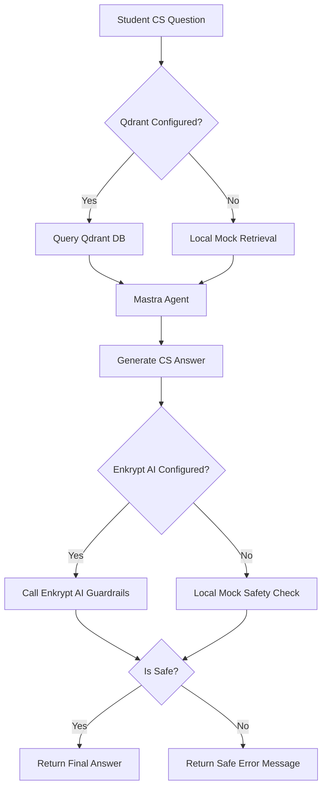

# 🎓 SafeStudy Agent - CS Learning Assistant

SafeStudy Agent is a minimal TypeScript MVP built for a hackathon using the **Mastra AI framework**, **Qdrant Vector Database**, and **Enkrypt AI Guardrails**. It enables computer science students to ask questions, retrieve course study notes, and receive verified safe responses.

## 🚀 How it Works



1. **Ask**: The student asks a computer science question (e.g., *"What is 2NF?"*).
2. **Retrieve**: The agent uses the `searchNotesTool` to retrieve relevant study notes from the database.
3. **Answer**: The Mastra Agent synthesizes the notes to construct a concise response.
4. **Guard**: The answer is validated using Enkrypt AI Guardrails to check for toxicity, prompt injection, and compliance.
5. **Respond**: If safe, the answer is returned. If flagged, a fallback warning is displayed: *"The generated response could not be verified as safe for students..."*

---

## 🛠️ Tech Stack & Features
- **Orchestration**: [Mastra AI Framework](https://mastra.ai) (Agents & Workflows)
- **Vector Database**: [Qdrant](https://qdrant.tech/) (with automatic local keyword-based fallback if offline or no credentials)
- **Safety & Guardrails**: [Enkrypt AI Guardrails](https://www.enkryptai.com/) (with local regex-based safety checks fallback)
- **Runtime**: Node.js & TypeScript with `tsx` for fast execution.

---

## 📂 Project Structure
- `src/mastra/index.ts` - Mastra instance initialization (exports agent and workflow).
- `src/mastra/agents/study-agent.ts` - Mastra Agent instructions and configuration.
- `src/mastra/tools/search-notes.ts` - Tool definition wrapper for database query.
- `src/mastra/workflows/study-workflow.ts` - Step-by-step workflow DAG (retrieve ➡️ answer ➡️ validate).
- `src/mastra/utils/qdrant-client.ts` - Qdrant service and local storage mock search.
- `src/mastra/utils/guardrails.ts` - Enkrypt AI API client and local mock safety check.
- `src/mastra/utils/seed.ts` - Database seeding utility.
- `src/test-run.ts` - Test execution script validating safe & unsafe scenarios.

---

## 🚀 Setup & Execution

### 1. Installation
Clone the repository, navigate to `safestudy-agent`, and install dependencies:
```bash
npm install
```

### 2. Environment Configuration
Copy the environment variables:
```bash
cp .env.example .env
```
Fill in the keys in `.env` if you have active accounts for OpenAI/Gemini, Qdrant, and Enkrypt AI.
> **Note**: If `QDRANT_URL` or `ENKRYPTAI_API_KEY` are not set, the app will automatically run in local mock mode without throwing errors.

### 3. Seed the Dataset
Populate the database/local storage with CS study notes:
```bash
npm run seed
```

### 4. Run Test Suite
Run the test runner to verify safe and unsafe queries:
```bash
npm run test-run
```

### 5. Launch Mastra Studio
Open the visual playground to test your workflow and agent:
```bash
npm run dev
```
Access the studio at [http://localhost:4111](http://localhost:4111).